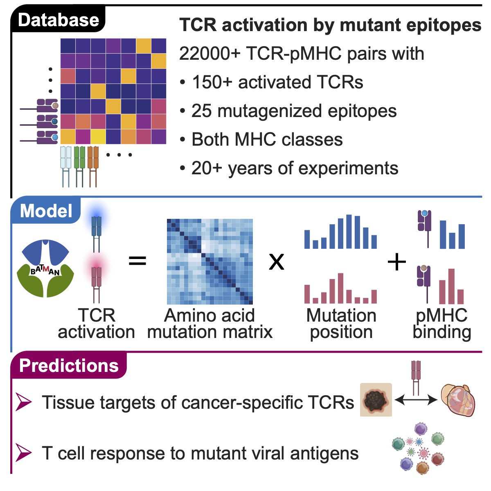

[](https://doi.org/10.1101/2024.01.22.576714)&emsp;[](https://colab.research.google.com/github/meyer-lab-cshl/BATMAN/blob/main/run_batman/pyBATMAN_Tutorial.ipynb) &emsp;[](https://pypi.org/project/pybatman/)&emsp;
# T cell receptor cross-reactivity prediction improved by a comprehensive mutational scan database

A single T Cell Receptor (TCR) can recognize a diverse variety of peptides, an essential property known as TCR cross-reactivity.
Predicting which peptides a TCR cross-reacts to is critical for numerous applications, including predicting viral escape, cancer
neoantigen immunogenicity, autoimmunity, and off-target toxicity of T-cell-based therapies. But predicting TCR activation is
challenging due to the lack of both unbiased benchmarking datasets and computational methods that are sensitive to small mutations to a peptide. 

Here, we curated a comprehensive database, called BATCAVE, developed an interpretable Bayesian model, called BATMAN (<ins>B</ins>ayesian Inference of <ins>A</ins>ctivation of <ins>T</ins>CR by <ins>M</ins>utant <ins>An</ins>tigens) and show varied applications thereof.

<div align='center'>

</div>

BATCAVE encompasses complete single amino acid mutational assays of more than 22000
TCR-peptide pairs, centered around 25 immunogenic human and mouse epitopes, across both major histocompatibility complex
classes, against 151 TCRs. 

BATMAN predicts TCR activation by mutant peptides based on their distances to the TCR's index peptide. The peptide-to-index distance is a product of a
a) learned positional weight profile vector, corresponding to effects of mutated residues at different positions in the sequence,
b) a learned AA substitution distance from the index peptide amino acid to the mutant amino acid and c) an optional scalar weight,
also specific for individual TCRs, corresponding to the pMHC binding category.

BATMAN can be trained in two modes: (1) within-TCR, where the train and test peptides are associated with the same TCR, and BATMAN-inferred
positional weight profiles are TCR-specific, and (2) leave-one-TCR-out, where peptides are tested for activation of a TCR left out of the
training data, and BATMAN-inferred positional weight profile is common across all TCRs.

We also developed an active learning version of BATMAN, which can efficiently learn the binding
profile of a novel TCR by selecting an informative yet small number of peptides to assay. When validated on our database,
BATMAN outperforms existing methods and reveals important biochemical predictors of TCR-peptide interactions.

Finally, we demonstrate the broad applicability of BATMAN, including for predicting off-target effects for TCR-based therapies and
polyclonal T cell responses.

For access to the software and an interactive tutorial refer to our [pyBATMAN github page](https://github.com/meyer-lab-cshl/BATMAN/tree/main) and included [tutorial in jupyter notebook](https://github.com/meyer-lab-cshl/BATMAN-paper/blob/main/run_batman/pyBATMAN_Tutorial.ipynb) [](https://colab.research.google.com/github/meyer-lab-cshl/BATMAN/blob/main/run_batman/pyBATMAN_Tutorial.ipynb).


# BATMAN preprint
The folder [paper_figures](https://github.com/meyer-lab-cshl/BATMAN-paper/tree/main/results_batman/paper_figures) in this repository contains all code and raw data to reproduce figures in our BATMAN [preprint](https://www.biorxiv.org/content/10.1101/2024.01.22.576714v3) - now accepted at Cell Systems. If you use or refer to BATMAN or BATCAVE in your work, please cite us as

```
@article{banerjee2025comprehensive,
  title={Comprehensive epitope mutational scan database enables accurate T cell receptor cross-reactivity prediction},
  author={Banerjee, Amitava and Pattinson, David J and Wincek, Cornelia L and Bunk, Paul and Axhemi, Armend and Chapin, Sarah R and Navlakha, Saket and Meyer, Hannah V},
  journal={bioRxiv},
  pages={2024--01},
  year={2025}
}
```

# Downloading BATCAVE dataset
The fully curated database of TCR-pMHC interactions can be downloaded from the [database folder](https://github.com/meyer-lab-cshl/BATMAN-paper/tree/main/results_batman/tcr_epitope_datasets/mutational_scan_datasets/database) in this repository. 
